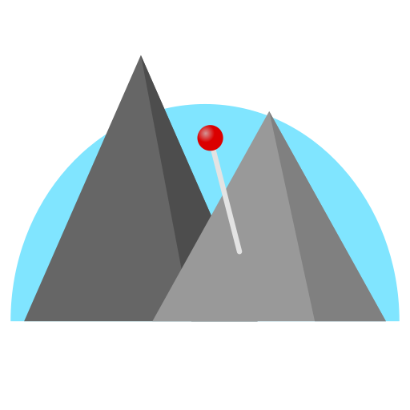

<p align="center"><p/>

# GeoViewer

## Introduction

GeoViewer is an application aiming to combine model viewing with map rendering to visualize models in their respective geographic context.
It enables you to load 3D models at their correct geographic position and view them with their surroundings.

This software was developed during a practical software project for the computer science bachelor by a team of five students.

## Installation

Download the respective folder from releases and unpack it. The application supports Windows 10/11 and Ubuntu 22.04 (should also work for newer versions).

## Development

GeoViewer was developed using the [Unity Game Engine](https://unity.com/) (2022.3.13f1 LTS) over the timespan of half a year.

## Data

The application uses [Openstreetmap](https://www.openstreetmap.org/copyright) for fetching the street map data and supports diplaying height data served through an [Opentopodata](https://www.opentopodata.org/)-compatible API. The respective URLs are defined in the config file found at

**Windows:** `AppData/Roaming/GeoViewer`

**Linux:** `$XDG_CONFIG_HOME/GeoViewer`, usually `~/.config/GeoViewer`

We do not recommend using the free public API from Opentopodata, as it is too slow at delivering the height data to the application. You can either host your own instance, which allows you to use your own datasets to display the height data or use another compatible elevation service (for example [Google Elevation API](https://developers.google.com/maps/documentation/elevation/start)). We recommend using [TopoSharp](https://github.com/LGK-Productions/TopoSharp) as a replacement of Opentopodata, as it is optimized for this Application. In case the map loading takes a lot of time, consider lowering the MeshResolution in the config.

## Models

GeoViewer uses the [Runtime OBJ Importer](https://assetstore.unity.com/packages/tools/modeling/runtime-obj-importer-49547) to import OBJ-Files at runtime and display them in the scene. This allows importing models with multiple textures. Currently, meshes are not being optimized by the application. It is also not possible to load multiple models into a scene or use formats other than OBJ.
For positioning the model, you can select a text file containing the position of the object in ECEF-Coordinates in the following format:

```
# OFFSET_X OFFSET_Y OFFSET_Z
4147504.614 606867.079 4791950.573
```

Alternatively, you can enter the latitude and longitude of the position where the model should be placed in the import menu dialogue.

## Tools

For interacting with the model, the application provides the following builtin tools:

**Select:** Used to select/deselect models

**Move:** Used to move selected models on all axes

**Rotate:** Used to rotate selected models around the y-axis

**Scale:** Used to scale models uniformly

**Measure:** Used to measure real world distances

Operations can be undone/redone using Ctrl+Z/Ctrl+Y

## Data Layers

GeoViewer uses a layer system to display map data, which can be configured in the config file. It differentiates between texture layers, which retrieve images and render them onto the map, and mesh layers, which retrieve height data for an area and display it as a mesh. Currently available are the following layer types:

**OsmTextureLayer**: A texture layer for retrieving image tiles from an Openstreetmap compatible service.

**OtdMeshLayer**: A mesh layer for requesting height data from an Opentopodata compatible service (for example [Google Elevation API](https://developers.google.com/maps/documentation/elevation/start))

**TopoSharp**: A layer for requesting height data from [TopoSharp's](https://github.com/LGK-Productions/TopoSharp) v2 API. This includes being able to request data from the [TopoBathy3D layer](https://www.arcgis.com/home/item.html?id=0c69ba5a5d254118841d43f03aa3e97d) from esri.

All these layers can be added in the config. Which layer will be rendered will be determined by the layer's priority.

## Contributing

If you have encounter a bug or have any suggestions, feel free to open an issue.

We're also accepting pull requests, though we ask you to contact us before submitting larger changes to the project in case we have a different vision for it.